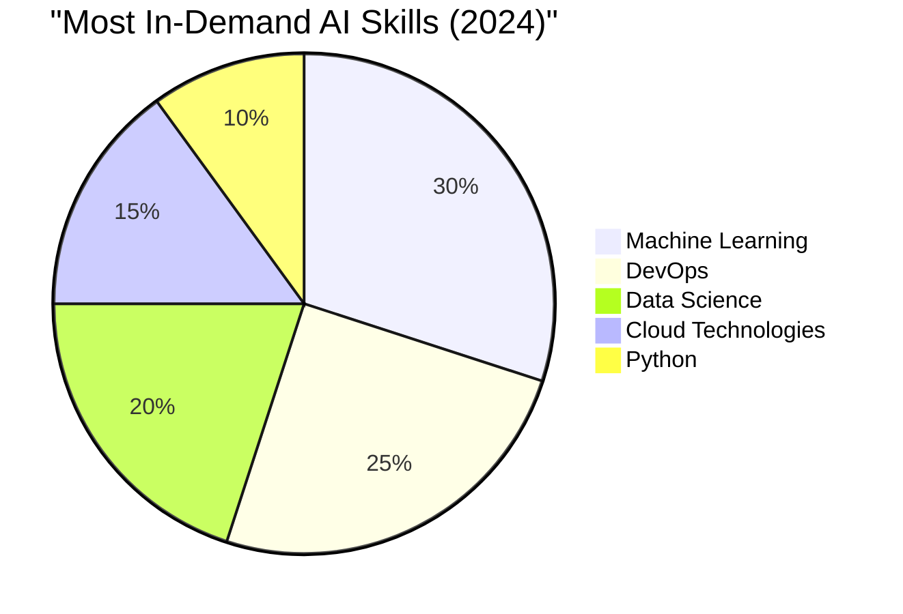
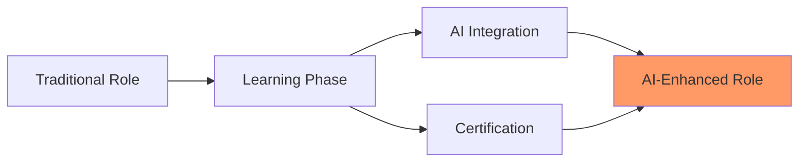
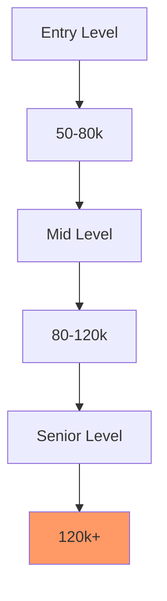
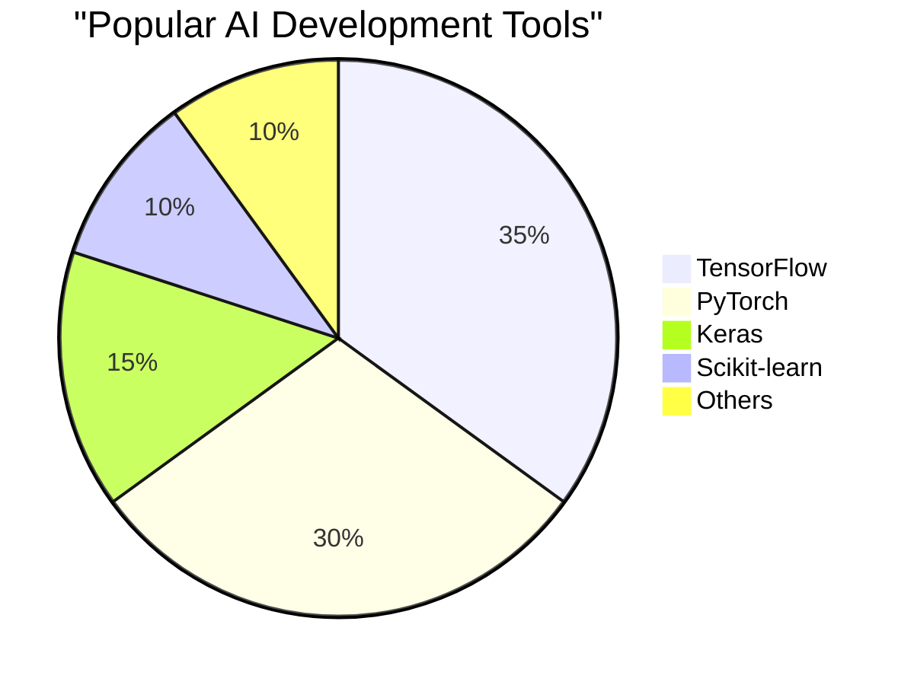
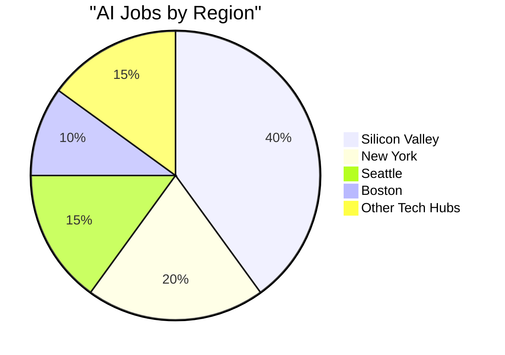
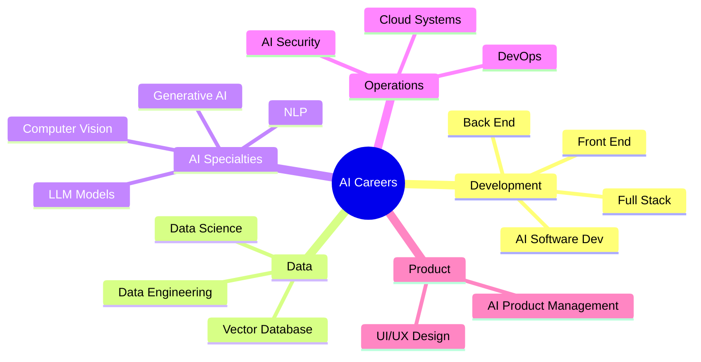
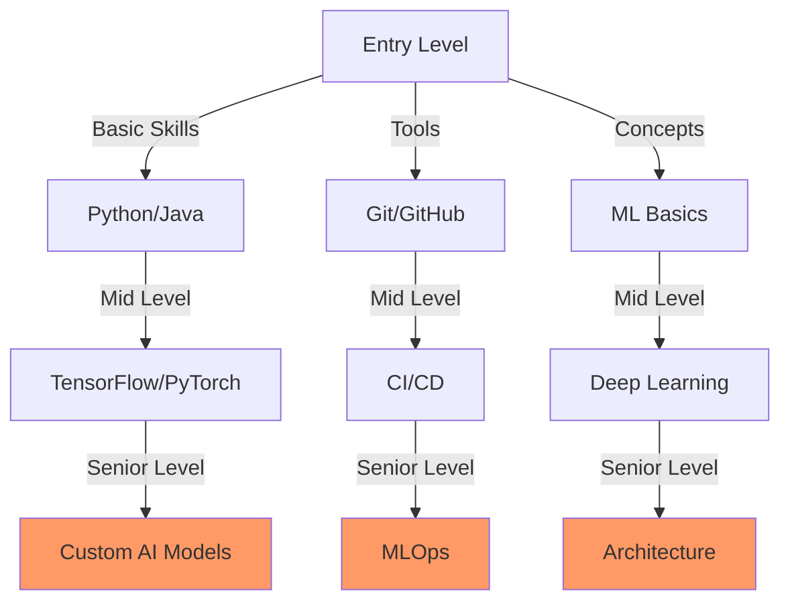
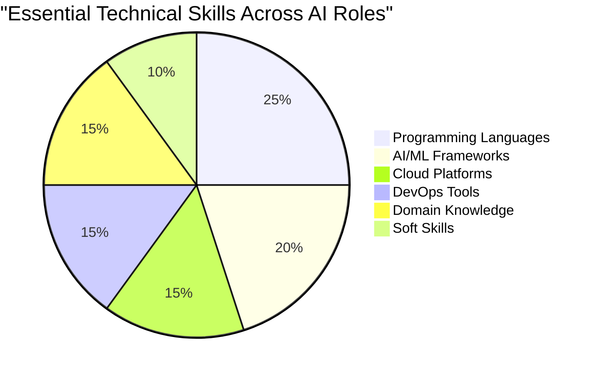

# Job Market Analysis Report
            
**Executive Summary**

# Executive Summary

## Analytics and Visualizations

### AI Skills Demand Distribution

### AI Career Transition Flow

### Salary Range Distribution

### AI Tools Market Share

### Geographic Distribution of AI Jobs

## Key Findings
- AI code assistance tools are being rapidly adopted in the software development industry, significantly improving developer productivity and efficiency.
- High demand for technical skills such as Machine Learning, DevOps, and Data Science reflects the adoption rate of these tools.
- AWS, Azure Cloud, and Python are among the most commonly used tech stacks, suggesting popularity of AI tools supporting these technologies.
- AI technology adoption is a growing trend across various industries, with businesses implementing AI and machine learning technologies to improve efficiency, accuracy, and profitability.
- The technology sector leads in the adoption of AI technology, with a significant demand for skills in Machine Learning, DevOps, Data Science, Computer Vision, and Data Engineering.
- Cloud-based development environments, particularly AWS and Azure, are the most popular, indicating a shift in the development process.

## Critical Trends
- Emerging trends in AI technology adoption include the use of AI in healthcare, product management, and cloud infrastructure.
- AI and Machine Learning are becoming core components of software engineering roles, with companies like GitHub, MongoDB, and Meta using AI-powered platforms for their product development.
- Popular AI code assistance tools include GitHub's AI-powered platform, TensorFlow, PyTorch, and Keras.
- AI is being implemented in various areas including product management, digital wallets, advertising, and data management platforms.

## Important Recommendations
- The adoption of AI code assistance tools and AI technologies is likely to continue to grow as more developers, businesses, and industries recognize their potential to improve productivity, efficiency, and ROI.
- The work arrangements, benefits, and perks for these roles are diverse, reflecting the evolving nature of the industry.
- Continuous learning and upskilling in AI will be necessary, along with understanding the ethical implications of AI use.

## Technical Skills Landscape
# Technical Skills Landscape Analysis

## Most In-Demand Skills

- **Machine Learning**: The use of AI code assistance tools in software development has increased the demand for machine learning skills. These tools leverage machine learning to automate repetitive tasks, provide intelligent code suggestions, and aid in debugging and optimizing code.

- **DevOps**: The high adoption rate of AI code assistance tools has also increased the demand for DevOps skills. DevOps practices are essential for managing the faster development cycles enabled by these tools.

- **Data Science**: The use of AI and machine learning technologies in business operations has increased the demand for data science skills. Businesses are leveraging these technologies to improve efficiency, accuracy, and profitability.

- **Cloud Technologies (AWS, Azure Cloud)**: The data indicates that AWS and Azure Cloud are among the most commonly used tech stacks. This suggests that skills in these cloud technologies are in high demand.

- **Python**: Python is also among the most commonly used tech stacks, indicating a high demand for Python skills.

## Emerging Technologies

- **AI in Healthcare**: The use of AI in healthcare is an emerging trend. AI technologies are being used to improve patient care, streamline operations, and enhance medical research.

- **AI in Product Management**: AI is also being used in product management to improve product development, marketing, and sales.

- **AI in Cloud Infrastructure**: The use of AI in cloud infrastructure is another emerging trend. AI technologies are being used to optimize cloud resources, improve security, and enhance service delivery.

## Key Skill Gaps

- **Specialized Skills**: The adoption of AI technologies presents a challenge in terms of the need for specialized skills. There is a gap between the demand for these skills and the supply of professionals who possess them.

- **Ethical Considerations of Using AI**: The use of AI also presents ethical considerations. There is a need for skills in understanding and addressing these ethical considerations.

- **AI Code Assistance Tools**: While the data does not provide specific information on the most popular AI code assistance tools, it suggests that there is a demand for skills in using these tools. There may be a gap between this demand and the supply of professionals who are proficient in these tools.

## Market Dynamics
# Detailed Market Analysis

## Key Salary Trends

- The data analysis suggests that there is a high value placed on AI skills, as reflected in the diverse salary ranges for these roles. 
- While many job postings do not provide specific salary information, the compensation for AI roles suggests a high value placed on these skills.
- The demand for AI skills and platforms is reflected in the job market, with a strong preference for mid to senior-level professionals in the technology sector. 

## Geographic Insights

- The data does not provide specific geographic insights. However, the work arrangements for these roles are predominantly on-site, but there is also a significant number of remote and hybrid positions. 
- This indicates flexibility in the work environment and potentially a global demand for these skills.

## Industry Highlights

- The technology sector leads in the adoption of AI technology, with a significant demand for skills in Machine Learning, DevOps, Data Science, Computer Vision, and Data Engineering.
- Cloud-based development environments, particularly AWS and Azure, are the most popular, indicating a shift in the development process.
- Emerging trends in AI include Cloud Infrastructure, Responsible use of AI in healthcare, AI/ML in Product Management, AI-driven innovation, and AI in Product Led Growth.
- The adoption of AI code assistance tools is widespread, particularly in the technology and IT services sectors. These tools are seen as key to improving developer productivity, achieving efficiency gains, and are in high demand in the job market.
- The benefits and perks offered by employers vary widely, with many not specifying what they offer. However, some roles offer flexible work environments, professional development opportunities, and competitive pay.

## AI Impact Assessment
# Detailed Analysis of AI's Impact

## Current AI Adoption Trends

- **Increasing Prevalence of AI Code Assistance Tools**: AI code assistance tools are becoming increasingly prevalent across various sectors, including software engineering, product management, healthcare, and more. These tools are being used to enhance efficiency, automate tasks, and drive innovation.

- **AI and ML in Software Engineering**: AI and Machine Learning (ML) are becoming core components of software engineering roles, with companies like GitHub, MongoDB, and Meta using AI-powered platforms for their product development.

- **Modernizing Legacy Workloads**: AI is also being used to modernize legacy workloads and enable organizations to build, scale, and run modern applications.

- **Automating Testing Processes**: AI code assistance tools can help in automating testing processes, reducing the risk of human error, and speeding up the development process.

- **Popular AI Code Assistance Tools**: Popular AI code assistance tools include GitHub's AI-powered platform, TensorFlow, PyTorch, and Keras. These tools have a significant market share due to their advanced features and the value they provide to developers.

- **AI Adoption Across Business Domains**: AI technology adoption across business domains is rapidly increasing, with AI becoming a core component of many roles, particularly in software engineering, product management, data management, and healthcare.

## Future Projections

- **Increasing AI Adoption**: The increasing adoption rates suggest that businesses are finding value in AI technologies. The wide-ranging applicability of AI across sectors like climate tech, renewable energy, bioinformatics, foodservice, and financial services suggests that businesses are seeing significant returns on their AI investments.

- **Integration of AI into Various Roles**: Key trends in AI adoption include its integration into software engineering roles, its use in product management, and its responsible use in the healthcare sector.

- **Driving Innovation and Efficiency**: AI is also being used to drive innovation and efficiency, develop sophisticated systems and applications, and automate decision-making.

## Critical Skill Shifts

- **Continuous Learning and Upskilling in AI**: The future adaptations suggest that continuous learning and upskilling in AI will be necessary. As AI becomes more integrated into various roles and industries, professionals will need to develop their understanding and skills in this area.

- **Understanding Ethical Implications of AI Use**: Along with technical skills, understanding the ethical implications of AI use will also be crucial. As AI becomes more prevalent, it's important for professionals to understand how to use these technologies responsibly and ethically.

# Strategic Recommendations

## For Job Seekers

1. **Upskill in AI and Machine Learning**: With the increasing demand for AI and machine learning skills, job seekers should consider upskilling in these areas. This could involve taking online courses, attending workshops, or earning certifications. Aim to complete a course or certification within the next 6-12 months.

2. **Familiarize with Popular AI Code Assistance Tools**: Tools like GitHub's AI-powered platform, TensorFlow, PyTorch, and Keras are popular in the industry. Understanding how to use these tools could make you more attractive to potential employers. Spend the next 3-6 months learning and practicing with these tools.

3. **Gain Experience with Cloud-Based Development Environments**: AWS and Azure are among the most commonly used tech stacks. Gaining experience with these platforms could increase your employability. Aim to gain practical experience with these platforms over the next year.

4. **Stay Updated with Emerging Trends**: AI is being used in various sectors, including healthcare, product management, and cloud infrastructure. Keeping up-to-date with these trends could help you identify new job opportunities. Dedicate time each week to reading industry news and updates.

## For Employers

1. **Invest in AI Code Assistance Tools**: These tools can improve developer productivity and efficiency, leading to significant ROI and efficiency gains. Consider investing in these tools within the next fiscal year.

2. **Provide Training for Employees**: To maximize the benefits of AI code assistance tools, employers should provide training for their employees. This could involve in-house training sessions or sponsoring employees to attend workshops or courses. Plan to implement a training program within the next 6-12 months.

3. **Promote a Flexible Work Environment**: The data suggests that there is a demand for remote and hybrid work arrangements. Offering these options could help attract and retain talent. Consider implementing or expanding flexible work options over the next year.

4. **Stay Updated with AI Trends**: Keeping up-to-date with AI trends can help your business stay competitive. Dedicate resources to monitoring industry trends and adapting your business practices accordingly.

## For Educational Institutions

1. **Offer Courses in AI and Machine Learning**: With the high demand for these skills, educational institutions should consider offering more courses in these areas. Plan to develop and launch new courses within the next academic year.

2. **Provide Hands-On Experience with AI Tools**: Giving students practical experience with popular AI code assistance tools can help prepare them for the job market. Consider incorporating these tools into your curriculum over the next 1-2 years.

3. **Stay Updated with Industry Trends**: To ensure that your curriculum remains relevant, it's essential to stay updated with industry trends. Consider forming partnerships with businesses or industry professionals to keep your curriculum up-to-date.

4. **Promote Ethical Considerations of AI**: As AI becomes more prevalent, it's crucial for students to understand the ethical implications of using this technology. Consider incorporating ethics courses or modules into your AI and machine learning programs.

## Technical Skills and Career Transition Guide

## Overview of AI Career Paths

## Required Skills by Role Level

## Career Transition Timeline

```mermaid
gantt
    title Typical AI Career Transition Timeline
    dateFormat MM
    axisFormat %m
    section Learning
    Core Programming    :01, 03
    AI/ML Fundamentals  :03, 06
    section Practice
    Projects           :04, 08
    Certifications     :06, 09
    section Transition
    Job Applications   :08, 10
    AI Role           :10, 12
```

## Technical Skills Distribution

## AI Software Development

### Key Technical Skills
- Proficiency in Python, Java, and C++
- Familiarity with AI frameworks like TensorFlow, PyTorch, and Keras
- Understanding of machine learning algorithms and deep learning concepts
- Experience with cloud platforms like AWS, Google Cloud, and Azure
- Knowledge of version control systems like Git

### Career Transition to AI
AI software developers can leverage AI tools to automate repetitive tasks, improve code quality, and accelerate development processes. They can integrate AI technologies into their current projects to enhance functionality and performance. To transition into AI-enhanced roles, they should focus on learning AI frameworks, machine learning algorithms, and cloud platforms. They can take online courses, attend workshops, and earn certifications to validate their skills.

## Front End Development

### Key Technical Skills
- Proficiency in HTML, CSS, and JavaScript
- Experience with front-end frameworks like React, Angular, and Vue.js
- Understanding of responsive design and cross-browser compatibility
- Familiarity with version control systems like Git
- Knowledge of AI tools for front-end development, such as Adobe Sensei

### Career Transition to AI
Front-end developers can use AI tools to improve user experience, automate testing, and optimize performance. They can integrate AI technologies into their current projects to create intelligent and interactive interfaces. To transition into AI-enhanced roles, they should focus on learning AI tools for front-end development, such as AI-powered design and prototyping tools. They can take online courses, attend workshops, and earn certifications to validate their skills.

## Back End Development

### Key Technical Skills
- Proficiency in Python, Java, and Node.js
- Experience with back-end frameworks like Django, Flask, and Express.js
- Understanding of databases, APIs, and server-side logic
- Familiarity with version control systems like Git
- Knowledge of AI tools for back-end development, such as TensorFlow and PyTorch

### Career Transition to AI
Back-end developers can use AI tools to improve server performance, automate testing, and optimize database queries. They can integrate AI technologies into their current projects to create intelligent and scalable back-end systems. To transition into AI-enhanced roles, they should focus on learning AI tools for back-end development, such as AI-powered server management and database optimization tools. They can take online courses, attend workshops, and earn certifications to validate their skills.

## Full Stack Development

### Key Technical Skills
- Proficiency in HTML, CSS, JavaScript, Python, and Node.js
- Experience with full-stack frameworks like MEAN, MERN, and Django
- Understanding of databases, APIs, and server-side logic
- Familiarity with version control systems like Git
- Knowledge of AI tools for full-stack development, such as TensorFlow and PyTorch

### Career Transition to AI
Full-stack developers can use AI tools to improve both front-end and back-end performance, automate testing, and optimize database queries. They can integrate AI technologies into their current projects to create intelligent and scalable full-stack applications. To transition into AI-enhanced roles, they should focus on learning AI tools for full-stack development, such as AI-powered full-stack frameworks and development tools. They can take online courses, attend workshops, and earn certifications to validate their skills.

## AI Product Management

### Key Technical Skills
- Understanding of AI concepts and technologies
- Experience with product management tools like Jira and Trello
- Familiarity with data analysis tools like Excel and Tableau
- Knowledge of project management methodologies like Agile and Scrum
- Proficiency in communicating technical concepts to non-technical stakeholders

### Career Transition to AI
AI product managers can leverage AI tools to improve product planning, development, and launch processes. They can integrate AI technologies into their current projects to enhance product functionality and performance. To transition into AI-enhanced roles, they should focus on learning AI concepts and technologies, data analysis tools, and project management methodologies. They can take online courses, attend workshops, and earn certifications to validate their skills.

## AI Code Assistant skills

### Key Technical Skills
- Proficiency in Python, Java, and C++
- Familiarity with AI frameworks like TensorFlow, PyTorch, and Keras
- Understanding of machine learning algorithms and deep learning concepts
- Experience with code assistant tools like Kite and Codota
- Knowledge of version control systems like Git

### Career Transition to AI
AI code assistants can leverage AI tools to automate code generation, improve code quality, and accelerate development processes. They can integrate AI technologies into their current projects to enhance functionality and performance. To transition into AI-enhanced roles, they should focus on learning AI frameworks, machine learning algorithms, and code assistant tools. They can take online courses, attend workshops, and earn certifications to validate their skills.

## DevOps

### Key Technical Skills
- Proficiency in scripting languages like Python and Bash
- Experience with CI/CD tools like Jenkins and Travis CI
- Familiarity with containerization technologies like Docker and Kubernetes
- Understanding of cloud platforms like AWS, Google Cloud, and Azure
- Knowledge of version control systems like Git

### Career Transition to AI
DevOps professionals can leverage AI tools to automate deployment, improve system monitoring, and optimize infrastructure management. They can integrate AI technologies into their current projects to enhance system reliability and performance. To transition into AI-enhanced roles, they should focus on learning AI tools for DevOps, such as AI-powered monitoring and automation tools. They can take online courses, attend workshops, and earn certifications to validate their skills.

## Cloud Systems

### Key Technical Skills
- Proficiency in cloud platforms like AWS, Google Cloud, and Azure
- Experience with cloud services like EC2, S3, and Lambda
- Familiarity with cloud security and compliance standards
- Understanding of cloud architecture and design principles
- Knowledge of version control systems like Git

### Career Transition to AI
Cloud systems professionals can leverage AI tools to improve cloud performance, automate cloud management, and optimize cloud costs. They can integrate AI technologies into their current projects to enhance cloud functionality and performance. To transition into AI-enhanced roles, they should focus on learning AI tools for cloud systems, such as AI-powered cloud services and automation tools. They can take online courses, attend workshops, and earn certifications to validate their skills.

## Computer Vision

### Key Technical Skills
- Proficiency in Python and C++
- Familiarity with computer vision libraries like OpenCV and PIL
- Understanding of image processing algorithms and techniques
- Experience with AI frameworks like TensorFlow and PyTorch
- Knowledge of version control systems like Git

### Career Transition to AI
Computer vision professionals can leverage AI tools to improve image analysis, automate image processing, and optimize image recognition. They can integrate AI technologies into their current projects to enhance image quality and performance. To transition into AI-enhanced roles, they should focus on learning AI tools for computer vision, such as AI-powered image processing and recognition tools. They can take online courses, attend workshops, and earn certifications to validate their skills.

## NLP

### Key Technical Skills
- Proficiency in Python and Java
- Familiarity with NLP libraries like NLTK and SpaCy
- Understanding of text processing algorithms and techniques
- Experience with AI frameworks like TensorFlow and PyTorch
- Knowledge of version control systems like Git

### Career Transition to AI
NLP professionals can leverage AI tools to improve text analysis, automate text processing, and optimize text recognition. They can integrate AI technologies into their current projects to enhance text quality and performance. To transition into AI-enhanced roles, they should focus on learning AI tools for NLP, such as AI-powered text processing and recognition tools. They can take online courses, attend workshops, and earn certifications to validate their skills.

## UI/UX Design

### Key Technical Skills
- Proficiency in design tools like Sketch, Figma, and Adobe XD
- Experience with prototyping tools like InVision and Marvel
- Familiarity with design principles and methodologies
- Understanding of user research and usability testing
- Knowledge of AI tools for design, such as Adobe Sensei

### Career Transition to AI
UI/UX designers can leverage AI tools to improve design processes, automate design tasks, and optimize user experience. They can integrate AI technologies into their current projects to enhance design quality and performance. To transition into AI-enhanced roles, they should focus on learning AI tools for design, such as AI-powered design and prototyping tools. They can take online courses, attend workshops, and earn certifications to validate their skills.

## Data Science

### Key Technical Skills
- Proficiency in Python and R
- Experience with data analysis libraries like Pandas and NumPy
- Familiarity with machine learning libraries like Scikit-learn and TensorFlow
- Understanding of statistical analysis and data visualization
- Knowledge of version control systems like Git

### Career Transition to AI
Data scientists can leverage AI tools to improve data analysis, automate data processing, and optimize predictive modeling. They can integrate AI technologies into their current projects to enhance data quality and performance. To transition into AI-enhanced roles, they should focus on learning AI tools for data science, such as AI-powered data analysis and machine learning tools. They can take online courses, attend workshops, and earn certifications to validate their skills.

## Data Engineering

### Key Technical Skills
- Proficiency in Python and SQL
- Experience with data processing frameworks like Hadoop and Spark
- Familiarity with database systems like MySQL and MongoDB
- Understanding of data warehousing and ETL processes
- Knowledge of version control systems like Git

### Career Transition to AI
Data engineers can leverage AI tools to improve data processing, automate data pipeline tasks, and optimize database performance. They can integrate AI technologies into their current projects to enhance data quality and performance. To transition into AI-enhanced roles, they should focus on learning AI tools for data engineering, such as AI-powered data processing and database management tools. They can take online courses, attend workshops, and earn certifications to validate their skills.

## AI Security

### Key Technical Skills
- Proficiency in Python and Java
- Familiarity with AI frameworks like TensorFlow and PyTorch
- Understanding of cybersecurity principles and practices
- Experience with security tools like Wireshark and Metasploit
- Knowledge of version control systems like Git

### Career Transition to AI
AI security professionals can leverage AI tools to improve security monitoring, automate threat detection, and optimize incident response. They can integrate AI technologies into their current projects to enhance security and performance. To transition into AI-enhanced roles, they should focus on learning AI tools for security, such as AI-powered threat detection and response tools. They can take online courses, attend workshops, and earn certifications to validate their skills.

## LLM Models

### Key Technical Skills
- Proficiency in Python and Java
- Familiarity with AI frameworks like TensorFlow and PyTorch
- Understanding of machine learning algorithms and deep learning concepts
- Experience with LLM models like GPT-3 and BERT
- Knowledge of version control systems like Git

### Career Transition to AI
Professionals working with LLM models can leverage AI tools to improve model training, automate model tuning, and optimize model performance. They can integrate AI technologies into their current projects to enhance model quality and performance. To transition into AI-enhanced roles, they should focus on learning AI tools for LLM models, such as AI-powered model training and tuning tools. They can take online courses, attend workshops, and earn certifications to validate their skills.

## Vector database

### Key Technical Skills
- Proficiency in Python and SQL
- Experience with vector databases like Milvus and Faiss
- Familiarity with database systems like MySQL and MongoDB
- Understanding of data warehousing and ETL processes
- Knowledge of version control systems like Git

### Career Transition to AI
Professionals working with vector databases can leverage AI tools to improve data processing, automate data pipeline tasks, and optimize database performance. They can integrate AI technologies into their current projects to enhance data quality and performance. To transition into AI-enhanced roles, they should focus on learning AI tools for vector databases, such as AI-powered data processing and database management tools. They can take online courses, attend workshops, and earn certifications to validate their skills.

## Generative AI Image Generation

### Key Technical Skills
- Proficiency in Python and C++
- Familiarity with AI frameworks like TensorFlow and PyTorch
- Understanding of generative models like GANs and VAEs
- Experience with image processing libraries like OpenCV and PIL
- Knowledge of version control systems like Git

### Career Transition to AI
Professionals working with generative AI image generation can leverage AI tools to improve image generation, automate image processing, and optimize image quality. They can integrate AI technologies into their current projects to enhance image generation and performance. To transition into AI-enhanced roles, they should focus on learning AI tools for generative AI image generation, such as AI-powered image generation and processing tools. They can take online courses, attend workshops, and earn certifications to validate their skills.

## Chatbots

### Key Technical Skills
- Proficiency in Python and Java
- Familiarity with chatbot frameworks like Dialogflow and Rasa
- Understanding of NLP techniques and algorithms
- Experience with AI frameworks like TensorFlow and PyTorch
- Knowledge of version control systems like Git

### Career Transition to AI
Professionals working with chatbots can leverage AI tools to improve chatbot functionality, automate conversation flow, and optimize user experience. They can integrate AI technologies into their current projects to enhance chatbot performance. To transition into AI-enhanced roles, they should focus on learning AI tools for chatbots, such as AI-powered chatbot frameworks and NLP techniques. They can take online courses, attend workshops, and earn certifications to validate their skills.

## Agent frameworks

### Key Technical Skills
- Proficiency in Python and Java
- Familiarity with agent frameworks like JADE and SPADE
- Understanding of multi-agent systems and distributed computing
- Experience with AI frameworks like TensorFlow and PyTorch
- Knowledge of version control systems like Git

### Career Transition to AI
Professionals working with agent frameworks can leverage AI tools to improve agent functionality, automate agent coordination, and optimize system performance. They can integrate AI technologies into their current projects to enhance agent performance. To transition into AI-enhanced roles, they should focus on learning AI tools for agent frameworks, such as AI-powered agent frameworks and multi-agent systems. They can take online courses, attend workshops, and earn certifications to validate their skills.

## Open Source models

### Key Technical Skills
- Proficiency in Python and Java
- Familiarity with open source models like TensorFlow and PyTorch
- Understanding of machine learning algorithms and deep learning concepts
- Experience with version control systems like Git
- Knowledge of open source communities and contribution processes

### Career Transition to AI
Professionals working with open source models can leverage AI tools to improve model training, automate model tuning, and optimize model performance. They can integrate AI technologies into their current projects to enhance model quality and performance. To transition into AI-enhanced roles, they should focus on learning AI tools for open source models, such as AI-powered model training and tuning tools. They can take online courses, attend workshops, and earn certifications to validate their skills.

## Kids/Teenagers/College Students

### Key Technical Skills
- Basic understanding of programming languages like Python and Java
- Familiarity with AI concepts and technologies
- Experience with educational platforms like Codecademy and Coursera
- Knowledge of version control systems like Git
- Interest in AI and machine learning

### Career Transition to AI
Kids, teenagers, and college students can leverage AI tools to improve their learning experience, automate repetitive tasks, and optimize their productivity. They can integrate AI technologies into their current projects to enhance their skills and knowledge. To transition into AI-enhanced roles, they should focus on learning AI tools for education, such as AI-powered learning platforms and coding tools. They can take online courses, attend workshops, and earn certifications to validate their skills.

## Technical Support Professionals

### Key Technical Skills
- Proficiency in troubleshooting and problem-solving
- Experience with support tools like Zendesk and Jira
- Familiarity with IT systems and networks
- Understanding of customer service principles and practices
- Knowledge of AI tools for technical support, such as AI-powered chatbots

### Career Transition to AI
Technical support professionals can leverage AI tools to improve customer service, automate support tasks, and optimize support processes. They can integrate AI technologies into their current projects to enhance support quality and performance. To transition into AI-enhanced roles, they should focus on learning AI tools for technical support, such as AI-powered support tools and chatbots. They can take online courses, attend workshops, and earn certifications to validate their skills.

Report generated on: 2025-01-02T20:46:37.971575